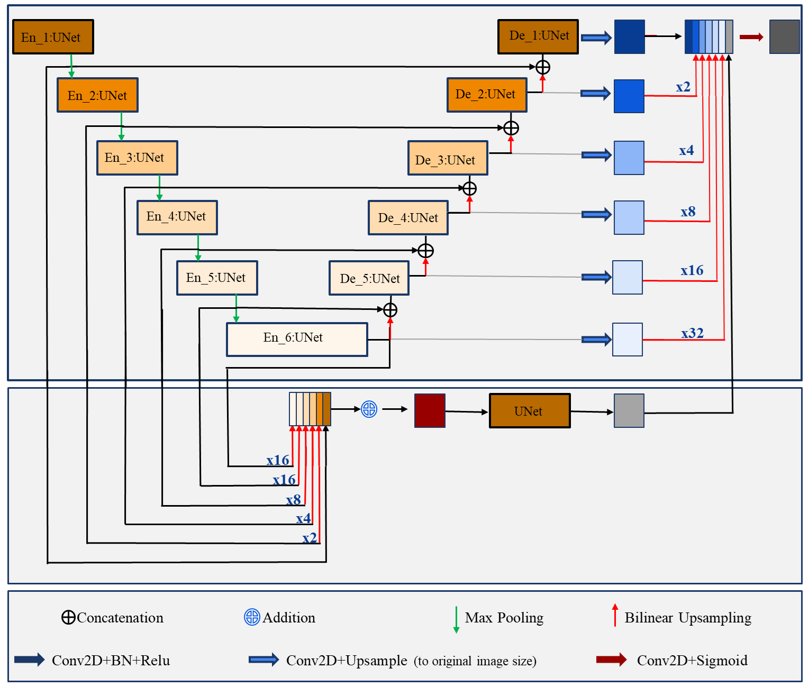
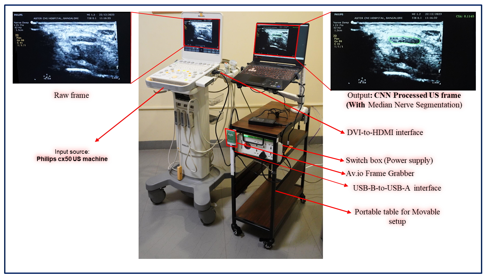

<h1>MN-Net for Real-Time Median Nerve Segmentation in Ultrasonography</h1>
<h2>Introduction</h2>
<ul>
<li> The median nerve is a major peripheral nerve that serves as a critical communication pathway between the hand and the central nervous system. Median nerve passes through a narrow passage called carpal tunnel. Injury and swelling of tissues within the tunnel leads to pressing of the median nerve. Carpal Tunnel Syndrome (CTS) is the most common peripheral neuropathy, which affects the thumb, index finger, middle finger, and lateral side of the ring finger. Typically, this arises due to increased pressure within the enclosed carpal tunnel that compresses the median nerve and is characterized by tingling and numbness of the affected hand. The diagnosis of CTS is often made based on a combination of clinical symptoms.</li>
<li></li> Motivation: Segmentation plays a vital role in diagnosing condition of carpal tunnel syndrome (CTS), guiding surgical procedures such as ultrasound-guided regional anesthesia (UGRA), identifying nerve entrapment syndromes, and understanding the knowledge of nerve anatomy.</li>
<li> The task of nerve localization in ultrasound imaging is challenging due to the presence of noise and other artifacts. It requires an extensive training and years of experience. Additionally, for the anesthetist, simultaneously maintaining both the needle and the nerve region in the ultrasound plane is difficult.</li>
</ul>
<h2>MN-Net Architecture</h2>
The CNN architecture of the proposed \textbf{MN-Net}, known as the Median Nerve Segmentation Network, is introduced. MN-Net is an efficient, lightweight network architecture; in this, there is a primary network comprising a UNet-based encoder-decoder structure, referred to as the main network. Alongside this main network, a subnetwork is integrated within it, learning concurrently with the main network and serving as the refinement network module.

<h2>Clinical setup for Real-Time Median Nerve Segmentation</h2>
The proposed model was deployed and made available as an End-to-End deep learning based software tool for Real-time checking in the clinical environment. It provides a parallel screen to the original US screen, which can show the US frame with a segmented MedianNerve along with its CSA.

<h2>How to run the code</h2>

First, ensure that PyTorch 1.10 or higher version is installed and working with GPU. Second, just clone or download this reporsitory. The testing.py file should run without any changes in the code. 

We can run from the command prompt: **`python testing.py`**.
<h2>Dependencies</h2>
How to run the code
<li> Python  </li>  
<li> PyTorch 1.10 </li>
